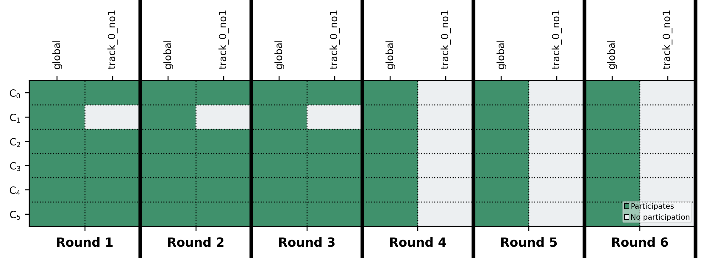

# Resolution Strategies for Client-Level Disagreement Scenarios in Federated Learning

[](https://www.gnu.org/licenses/gpl-3.0) [](https://www.python.org/downloads/)

> [!Note]
> The entire system, its motivation, and experimental results are described in detail in [the accompanying master's thesis](docs/FL_Disagreement_Resolution_Thesis_DaanRosendal.pdf).

## 📄 Description

This project addresses a critical limitation in standard Federated Learning (FL): the assumption of unconditional collaboration amongst all clients. In real-world scenarios (e.g., competing companies, regulatory constraints), clients may need to exclude each other's data or model updates due to client-level disagreements.

Our solution introduces a robust multi-track resolution approach that creates and manages multiple, isolated model update paths called "tracks". Each track corresponds to a unique set of client exclusion preferences, guaranteeing strict client exclusion and preventing cross-contamination and unfairness issues.

### Multi-track resolution in action



*This visualisation demonstrates temporal disagreement resolution ([Scenario 4](mock_etcd/scenarios/scenario4.json)) where Client 0 excludes Client 1 from rounds 1-3, creating separate tracks that automatically become inactive once the disagreement period expires.*

## 🛠 Installation

### Prerequisites

- Python 3.12 or higher
- [uv](https://docs.astral.sh/uv/) - Python package and project manager

### Setup instructions

1. **Install uv** (if not already installed):
   ```bash
   # On macOS and Linux
   curl -LsSf https://astral.sh/uv/install.sh | sh

   # On Windows
   powershell -c "irm https://astral.sh/uv/install.ps1 | iex"
   ```

2. **Clone the repository**:
   ```bash
   git clone https://github.com/DaanRosendal/fl-disagreement-resolution.git
   cd fl-disagreement-resolution
   ```

3. **Create virtual environment and install dependencies**:
   ```bash
   uv venv
   uv sync
   ```

4. **Activate the virtual environment** (optional, as `uv run` handles this automatically):
   ```bash
   # On Unix/macOS
   source .venv/bin/activate

   # On Windows
   .venv\Scripts\activate
   ```

## 🚀 Usage

### Running basic experiments

Run a simple federated learning experiment with disagreement resolution:

```bash
# Run scenario 1 with MNIST dataset
uv run scripts/run_fl.py -S 1 -e mnist -r 5 -l 1

# Run scenario 3 with N-CMAPSS dataset
uv run scripts/run_fl.py -S 3 -e n_cmapss -r 5 -l 1

# Run all scenarios with MNIST dataset
uv run scripts/run_fl.py -S all -e mnist -r 5 -l 1

# Run with custom client configuration
uv run scripts/run_fl.py -S 1 -e mnist -c 4 -r 10 -l 2

# Run with IID data distribution
uv run scripts/run_fl.py -S 1 -e mnist -c 6 -s -i
```

### Command line options

- `-S, --scenario <num>`: Scenario number (0-34) or 'all'
- `-e, --experiment <type>`: Dataset type ('mnist' or 'n_cmapss')
- `-c, --clients <ids>`: Number of clients or specific client IDs
- `-r, --rounds <num>`: Number of FL rounds (default: 3)
- `-l, --local-epochs <num>`: Local training epochs (default: 5)
- `-s, --setup-data`: Set up MNIST data (first run only)
- `-i, --iid`: Use IID data distribution
- `--verbose-plots`: Generate comprehensive visualisations

## 🔧 Configuration

The system uses a [DYNAMOS](https://github.com/Jorrit05/DYNAMOS)-inspired configuration approach with JSON files in the `mock_etcd/` directory:

### Main configuration (`mock_etcd/configuration.json`)

```json
{
  "experiment": {
    "type": "mnist",
    "fl_rounds": 5,
    "client_ids": [0, 1, 2, 3, 4, 5]
  },
  "disagreement": {
    "initiation_mechanism": "shallow",
    "lifting_mechanism": "shallow",
    "deep_lifting_finetune_rounds": 3
  },
  "training": {
    "batch_size": 64,
    "local_epochs": 10,
    "learning_rate": 0.001
  }
}
```

### Scenario definitions (`mock_etcd/scenarios/`)

Scenarios define specific disagreement patterns:

```json
{
  "name": "Simple Inbound Exclusion",
  "description": "Client 0 excludes client 1 from round 1 onwards",
  "num_clients": 6,
  "disagreements": {
    "client_0": [{
      "type": "inbound",
      "target": "client_1",
      "active_rounds": {"start": 1, "end": null}
    }]
  }
}
```

Available disagreement types:

- **inbound**: Exclude another client's updates from your model
- **outbound**: Prevent your updates from reaching another client
- **bidirectional**: Mutual exclusion between two clients
- **full**: Complete isolation from all other clients

## 🧪 Testing

### Validation suite

Run the comprehensive test suite to validate disagreement resolution across all scenarios:

```bash
# Test all scenarios with MNIST
uv run scripts/test_disagreement_scenarios.py all -e mnist -r 5 -l 1

# Test specific scenario
uv run scripts/test_disagreement_scenarios.py 1 -e mnist -r 10 -l 2

# Test with N-CMAPSS dataset (limited to ≤6 clients)
uv run scripts/test_disagreement_scenarios.py all -e n_cmapss -r 5 -l 1

# Test with verbose output and comprehensive plots
uv run scripts/test_disagreement_scenarios.py 5 -v --verbose-plots
```

The test suite automatically:

- ✅ Validates track creation matches expected patterns
- ✅ Verifies client isolation is properly enforced
- ✅ Checks temporal disagreement handling

### Scalability testing

Evaluate system performance across multiple scenarios:

```bash
# Run the first set of scalability scenarios (S7-S12) with MNIST dataset
for run in {1..5}; do
  for S in {7..12}; do # or, e.g., "for S in 25 26 29 30 31; do"
    uv run scripts/run_fl.py -S "$S" -e mnist -r 5 -l 1 # or "-e n_cmapss" for S13-S19
  done
done

output_dirs=($(find results -maxdepth 1 -type d ! -name . ! -name results ! -name comparisons ! -name collected_outputs -printf "results/%f\n" | sort))

# assuming the results directory contains only relevant results, i.e., was empty before executing the run_fl.py command
uv run scripts/compare_fl_runs.py "${output_dirs[@]}"
```

### Visualisation generation

Generate comprehensive analysis plots:

```bash
# Create track contribution visualisations (runs automatically at the end of each run)
uv run scripts/visualize_track_contributions.py results/fl_simulation_*

# Gather and compare outputs across scenarios (mostly useful for scalability testing)
uv run scripts/gather_simulation_outputs.py
```

## 📦 Dependencies / Technologies Used

**Core Framework:**
- **Python 3.12+**: Main programming language
- **PyTorch 2.7+**: Deep learning framework for model training
- **NumPy 2.2+**: Numerical computing for data handling

**Machine Learning:**
- **scikit-learn 1.6+**: ML utilities and metrics
- **torchvision 0.22+**: Computer vision datasets and transforms

**Visualisation & analysis:**
- **matplotlib 3.10+**: Plotting and visualisation
- **seaborn 0.13+**: Statistical data visualisation
- **brokenaxes 0.6+**: Advanced plot formatting

**Datasets:**
- **MNIST**: Classic handwritten digit recognition
- **N-CMAPSS**: NASA Commercial Modular Aero-Propulsion System Simulation for predictive maintenance of aircraft engines

## 📄 License

This project is licensed under the **GNU General Public License v3.0** - see the [LICENSE](LICENSE) file for details.

## 👨‍🎓 Academic context

This repository contains the complete implementation for the Master's thesis:

**"[Resolution Strategies for Client-Level Disagreement Scenarios in Federated Learning](docs/FL_Disagreement_Resolution_Thesis_DaanRosendal.pdf)"**
*By Daan Eduard Rosendal*
*University of Amsterdam, 2025*

The work serves as a proof-of-concept for handling realistic federated learning scenarios where unconditional client collaboration cannot be assumed.

## 🔗 Related projects

- **[DYNAMOS](https://github.com/Jorrit05/DYNAMOS)**: Microservice orchestration middleware that inspired our configuration architecture
- **[N-CMAPSS Data Preparation](https://github.com/DaanRosendal/N-CMAPSS_DL)**: Toolkit for preparing the NASA turbofan engine dataset

## 📊 Project structure

```text
fl-disagreement-resolution/
├── 📁 fl_client/                    # Client-side federated learning implementation
│   ├── __init__.py
│   ├── client.py                    # Core FL client logic and communication
│   ├── main.py                      # Client application entry point
│   ├── training.py                  # Local model training procedures
│   └── utils.py                     # Client utility functions
│
├── 📁 fl_server/                    # Server-side coordination and aggregation
│   ├── __init__.py
│   ├── aggregation.py               # Multi-track model aggregation strategies
│   ├── disagreement.py              # Disagreement detection and resolution logic
│   ├── evaluation.py                # Model evaluation and metrics collection
│   ├── main.py                      # Server application entry point
│   ├── server.py                    # Core FL server orchestration
│   └── utils.py                     # Server utility functions
│
├── 📁 fl_module/                    # Dataset handlers and ML models
│   ├── __init__.py
│   ├── base.py                      # Base classes for datasets and models
│   ├── models.py                    # Neural network architectures (CNN, MLP, LSTM)
│   ├── 📁 mnist/                    # MNIST dataset implementation
│   │   ├── __init__.py
│   │   ├── dataset.py               # MNIST data loading and preprocessing
│   │   └── utils.py                 # MNIST-specific utilities
│   └── 📁 n_cmapss/                 # N-CMAPSS dataset implementation
│       ├── __init__.py
│       ├── dataset.py               # N-CMAPSS data loading and preprocessing
│       └── utils.py                 # N-CMAPSS-specific utilities
│
├── 📁 scripts/                      # CLI tools and automation scripts
│   ├── compare_fl_runs.py           # Compare results across multiple FL runs
│   ├── gather_simulation_outputs.py # Collect and organize experimental outputs
│   ├── run_fl.py                    # Main experiment runner (scenarios 0-34)
│   ├── test_disagreement_scenarios.py # Validation suite for disagreement resolution
│   └── visualize_track_contributions.py # Generate track contribution plots
│
├── 📁 mock_etcd/                    # Configuration and scenario management
│   ├── configuration.json           # Main system configuration
│   ├── disagreements.json           # Disagreement definitions and rules
│   ├── etcd_loader.py              # Configuration loading utilities
│   └── 📁 scenarios/                # Disagreement scenario definitions (35 scenarios)
│       ├── scenario0.json           # Baseline: no disagreements
│       ├── scenario1.json           # Simple inbound exclusion
│       ├── scenario4.json           # Temporal disagreement (featured example)
│       ├── ...                      # Scenarios 2-34 covering various patterns
│       └── 📁 archive/              # Legacy scenario definitions
│
├── 📁 results/                      # Experimental outputs and analysis
│   └── 📁 collected_outputs/        # Aggregated visualisation outputs
│       ├── s1_mnist_track_contributions.png
│       ├── s4_mnist_track_contributions.png
│       ├── s*_scalability_comparison.png
│       └── ...                      # Generated plots for all scenarios
│
├── 📁 docs/                         # Documentation and technical diagrams
│   ├── FL_Disagreement_Resolution_Thesis_DaanRosendal.pdf # Master's thesis
│   └── 📁 drawio/                   # Technical architecture diagrams
│       ├── system_flow.drawio       # Overall system architecture
│       ├── fl-disagreement-resolution-design.drawio
│       ├── resolution-strategies.drawio
│       └── 📁 disagreement-scenarios-visualisations/
│           ├── legend.drawio        # Visualisation legend
│           ├── full-exclusion.drawio
│           ├── partial-data-exclusion.drawio
│           ├── bidirectional-*.drawio # Various bidirectional patterns
│           ├── inbound-*.drawio     # Inbound exclusion patterns
│           └── outbound-*.drawio    # Outbound exclusion patterns
│
├── 📁 data/                         # Dataset storage (created during setup)
├── 📁 logs/                         # Runtime logs and debugging output
├── fl_orchestrator.py               # High-level orchestration coordinator
├── pyproject.toml                   # Python project configuration and dependencies
├── uv.lock                          # Dependency lock file
├── LICENSE                          # GNU GPL v3.0 license
└── README.md                        # This comprehensive documentation
```

---

**🎯 Ready to explore federated learning with realistic client disagreements? Start with scenario 1:**

```bash
uv run scripts/run_fl.py -S 1 -e mnist -r 5 -l 1 -s -i
```
